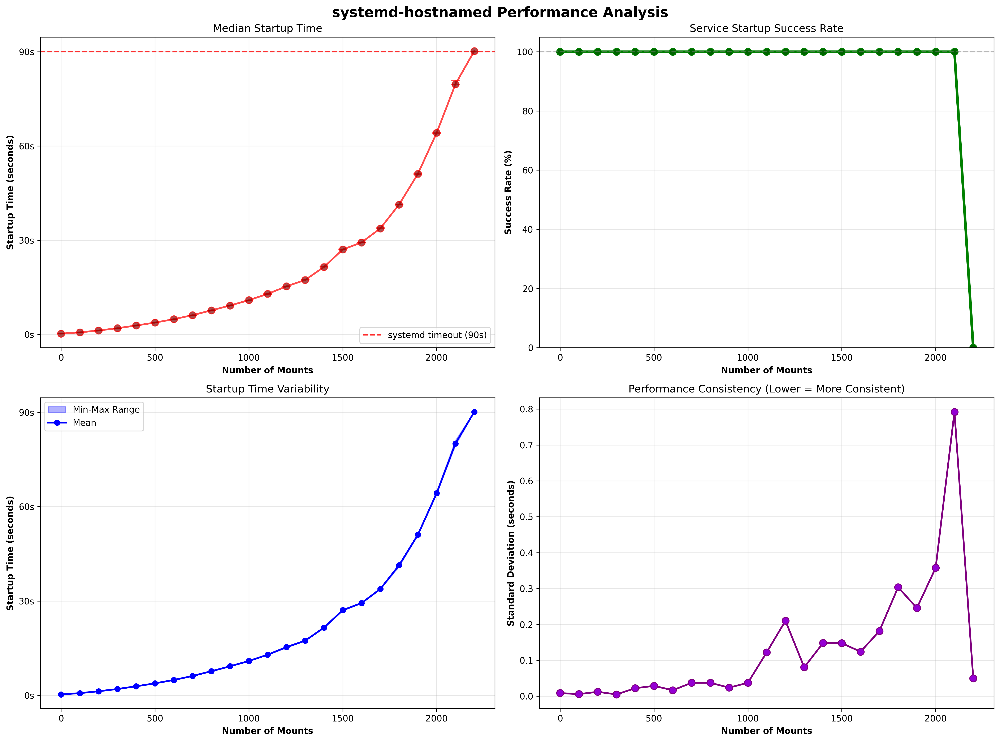
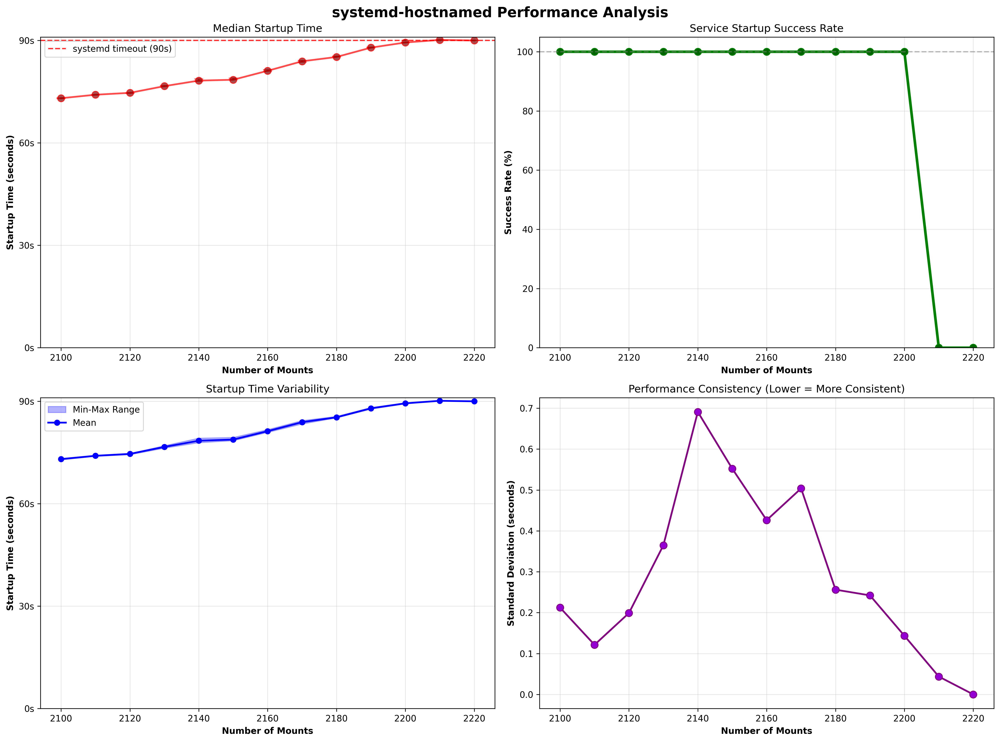

# systemd-hostnamed-benchmark

As part of some investigation work, it has been claimed that `systemd-hostnamed` can become unstable when there are too many volume mounts.

This benchmark was run on an Intel NUC in order to generate the two diagrams below that pretty clearly prove this:





The benchmark and visualisation scripts were generated with Claude 4 Sonnet and the full conversation plus script variations can be [read in prompting.md](./prompting.md).

Presumably none of this is perfect but I'm not trying to do super science by any means. Just enough to prove some rough correlation of a working theory was the goal.

Results will vary with your system specs of course.

Released as Creative Commons Zero because I really haven't created anything original myself here.

## Various commands used

Run benchmark

```console
$ sudo MOUNT_INCREMENT=100 MAX_MOUNTS=3000 ITERATIONS_PER_TEST=5 ./benchmark_mounts.sh
```

Unmount volumes when done (as script doesn't properly handle that)

```console
$ mount | grep mount_benchmark |  wc -l
```

View generated data

```console
$ python plot_results.py systemd_hostnamed_raw_data.csv
```
